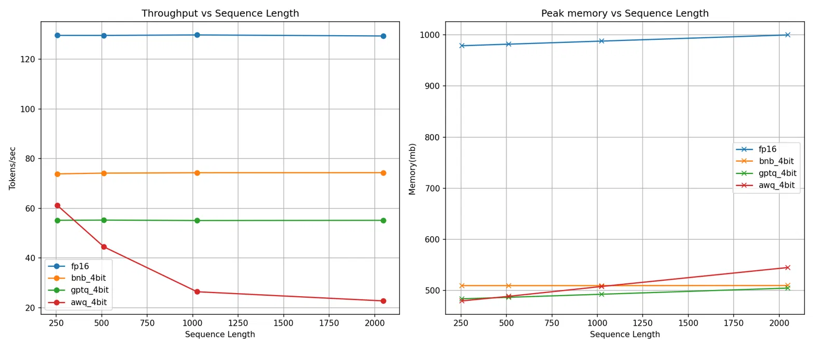

# LLM Inference Optimizer

Benchmarking and optimization toolkit for LLM inference with Qwen/Qwen2.5-0.5B model — comparing quantization methods (GPTQ, AWQ, BitsAndBytes) against an FP16 baseline. Each method was evaluated across 5 standard prompts and 4 sequence lengths (256, 512, 1024, 2048), measuring throughput, memory usage, and GPU kernel behavior using torch.profiler.

## Motivation

Large language models (LLMs) have proven their benefits and usability in numerous AI applications. However, model consumption is limited by the hardware resources on consumer friendly devices or edge devices, as big models require high memory usage. Therefore, researchers have developed quantization methods to allow higher adoption of LLMs with the goal of reducing memory usage while maintaining acceptable inference speed.

## Methods

### FP16 Baseline
The base Qwen2.5-0.5B model loaded in half-precision (FP16) using Hugging Face Transformers. This serves as the reference point for all comparisons — no quantization applied, native CUDA kernels for matrix multiplication.

### BitsAndBytes 4-bit (NF4)
Quantized at load time using BitsAndBytes with NF4 (NormalFloat4) quantization. NF4 distributes quantization levels according to a normal distribution, giving finer precision to the weight values that appear most frequently. No calibration data required — quantization is applied directly based on weight distributions.

### GPTQ 4-bit
Quantized locally using GPTQModel with 4-bit precision and group_size=128. GPTQ uses calibration data (1024 samples from C4) to quantize weights layer-by-layer, using Hessian-based error compensation to minimize output degradation. The Marlin inference kernel could not compile on the RTX 5060 (Blackwell, compute_120) due to CUDA toolkit version limitations, so the Triton backend was used as a fallback.

### AWQ 4-bit
Loaded from a pre-quantized model (RichardErkhov/Qwen_-_Qwen2.5-0.5B-awq) using AutoAWQ. AWQ identifies salient weights based on activation magnitudes and scales them up before quantization, giving them better representation within the 4-bit range. Local quantization was not possible due to the same Blackwell GPU kernel compatibility issue — both the AWQ CUDA kernels and the Marlin backend failed to compile for compute_120. The AutoAWQ fused modules were also unavailable, resulting in pure PyTorch fallback kernels for inference.

## Results

### Comparison Table

| Method | Model Memory (MB) | Peak Memory (MB) | Avg Tokens/sec | Memory Savings |
|--------|-------------------|-------------------|-----------------|----------------|
| FP16 (baseline) | 959 | 977 | ~129 | — |
| BitsAndBytes 4-bit | 459 | 509 | ~73 | 52% |
| GPTQ 4-bit (Triton) | 444 | 482 | ~56 | 54% |
| AWQ 4-bit (pre-quantized) | 438 | 475 | ~66 | 54% |

All three quantization methods achieve roughly 50% memory reduction, consistent with the expected compression from 16-bit to 4-bit weights. However, all quantized methods are slower than the FP16 baseline due to dequantization overhead on a model that fits comfortably in VRAM.

### Sequence Length Profiling



FP16, BitsAndBytes, and GPTQ maintain consistent throughput regardless of sequence length. AWQ degrades significantly — from 61 tokens/sec at 256 tokens to 23 tokens/sec at 2048 tokens — due to running on pure PyTorch fallback kernels without the optimized fused AWQ CUDA extensions. Memory usage grows gradually across all methods as the KV cache expands with longer sequences, though the increase is modest (~20 MB from 256 to 2048) given the small model size.

### FP16 Baseline
The dominant operation is aten::mm (matrix multiplication) at 66% of CUDA time. This means the GPU is spending most of its time doing math and not shuffling data around. Total CUDA time: 422ms.

### BitsAndBytes 4-bit (NF4)
The biggest cost is bitsandbytes::gemv_4bit at 42% — this is the dequantization + computation kernel. Then aten::copy_ takes 17%, which is the overhead of converting dequantized weights back to the right dtype. Total CUDA time: 422ms — same as FP16, but spread across more operations with more overhead.

### GPTQ 4-bit
dequant_kernel takes 40% of CUDA time — that's the Triton fallback dequantizing weights. Then aten::mm takes another 37% for the actual computation. So roughly half the time is dequantization overhead. Total CUDA time: 549ms — 30% more than FP16.

### AWQ 4-bit
awq_gemm_kernel dominates at 65% — this is a fused dequantize-and-multiply kernel, which sounds efficient, but it's running without the optimized CUDA extension. Total CUDA time: 610ms — 45% more than FP16

### Key takeaways
On a small model that fits in VRAM, quantization adds dequantization overhead without providing memory-pressure relief. FP16 spends its time on pure compute. Quantized methods spend significant time on dequantization. The speed benefits of quantization only materialize on larger models where memory bandwidth is the bottleneck.

## Key Findings
- Quantization is primarily a memory optimization, not a speed optimization
- On small models that fit in VRAM, quantization adds dequantization overhead
- AWQ degrades at longer sequences without optimized kernels
- When quantization WOULD help (larger models, memory-bound scenarios)

## Hardware

- **GPU:** NVIDIA GeForce RTX 5060 (8GB VRAM)
- **Architecture:** Blackwell (compute capability 12.0)
- **CUDA Version:** 13.0
- **Driver:** 580.126.09
- **OS:** Ubuntu 24.04
- **Python:** 3.12

**Note:** The RTX 5060 (Blackwell) is a very new architecture. Several quantization inference kernels (Marlin, ExLlamaV2, AWQ CUDA) do not yet support compute_120, requiring fallback backends (Triton) or pre-quantized models. This is documented throughout the results.

## How to Reproduce

```bash
git clone https://github.com/TrinhVox/llm-inference-optimizer.git
cd llm-inference-optimizer
python -m venv .venv
source .venv/bin/activate
pip install -r requirements.txt
```

Run the benchmarks:

```bash
cd src/llm_optimizer

# FP16 baseline
python baseline.py

# BitsAndBytes 4-bit
python bnb.py

# GPTQ 4-bit (first run quantizes, subsequent runs load saved model)
python gptq.py --quantize   # first time
python gptq.py              # subsequent runs

# AWQ 4-bit (pre-quantized model)
python awq_benchmark.py

# Profiling across sequence lengths
python benchmarks.py

# torch.profiler analysis
python profiling.py
```

Results are saved to the `results/` directory.